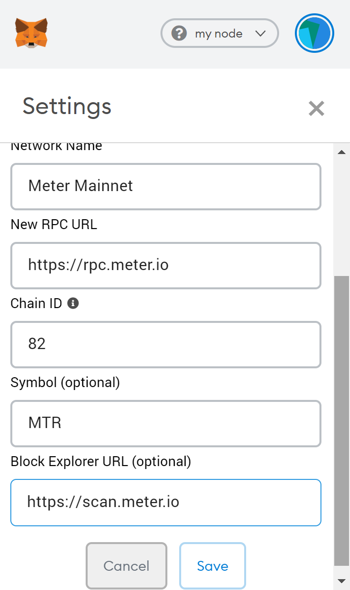

# Meter Incentive Programs to promote decentralization

The year 2022 served as a stark reminder to the pressing need of decentralization and decentralized finance — the heart of web3 ecosystem!

At Meter, the Meter Foundation strongly believes in creating a decentralized Meter network and have taken concrete steps to fulfil this obligation to our community through numerous incentive programs. &#x20;

**The incentive programs are aimed to;**

1. **Promote higher decentralization to ensure liveness and security of the Meter ecosystem thereby cementing our claim of the most decentralized side-chain scaling solution**
2. **Showcase the efficacy of the ‘HotStuff Consensus’ by maintaining the speed and performance of the ecosystem while supporting a higher number of nodes**

## Meter Ecosystem - Roadmap to 500 Nodes

Program Link: [https://forum.meter.io/t/meter-ecosystem-roadmap-to-500-nodes/190](https://forum.meter.io/t/meter-ecosystem-roadmap-to-500-nodes/190)

Under this program, Meter Foundation provides MTRG delegations to every node setup until we reach the first milestone of 500 nodes.

&#x20;

<figure><figcaption></figcaption></figure>

This program was critical in increasing the validator node count from 150 to over 280 in 2022.

### Actual Returns of a node

Below are the actual returns of a node with 22,500 MTRG Delegation and with a Tesla NFT delegation of 50,000 MTRG.&#x20;

<figure><figcaption></figcaption></figure>

<figure><figcaption></figcaption></figure>

**IMPORTANT UPDATE**

Tesla Validator NFTs are moved to Meter Network post this announcement - [TESLA Founding Validator NFTs returning to Meter Network! ](https://medium.com/meter-io/tesla-founding-validator-nfts-returning-to-meter-network-efdafa30476d)

<figure><figcaption></figcaption></figure>

<mark style="color:red;">**Post 30 April 2023, Tesla Founding Validator NFTs on Ethereum Network will cease to have utility or value.**</mark>

## MIP: Incentivizing TVL and Node Operations through Meter Foundation Node Delegation

Program Link: [https://forum.meter.io/t/mip-incentivizing-tvl-and-node-operations-through-meter-foundation-node-delegation/309](https://forum.meter.io/t/mip-incentivizing-tvl-and-node-operations-through-meter-foundation-node-delegation/309)

Meter Node Operators are the core community and the strongest supporters of the Meter Ecosystem. With this proposal, we aim to generate higher TVL on the network through our core community while providing adequate incentives to do so.

<figure><figcaption></figcaption></figure>

## Leveraging DeFI Ecosystem to benefit from Incentive Programs

DeFI users can leverage Meter DeFI ecosystem to benefit from Node Incentive programs without diluting their stablecoin positions.

<figure><figcaption></figcaption></figure>

Detailed interest gap strategy can be found on Medium: '[**METER UP your Stablecoin yield**](https://medium.com/meter-io/meter-up-your-stablecoin-yield-on-meter-network-3e382ca10699)**'**
