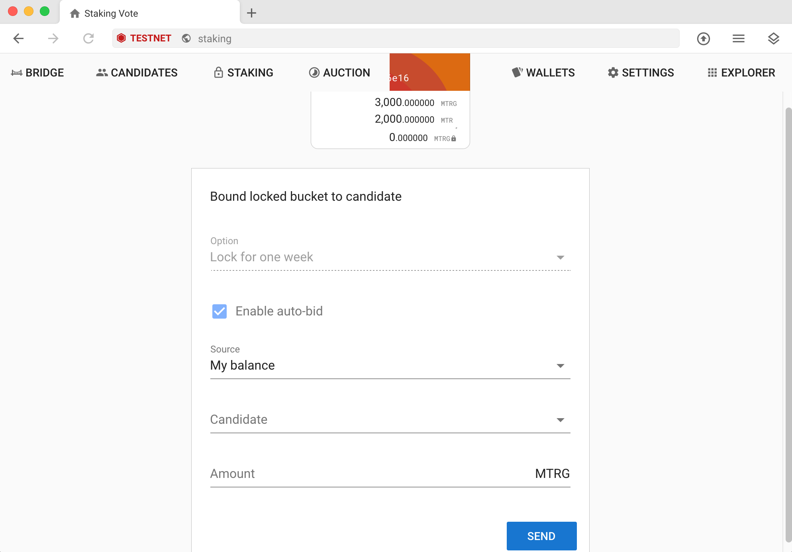

# Staking MTRG

You can earn MTR or MTRG and help secure the Meter network by staking your MTRG in the [Meter desktop wallet.](https://www.meter.io/wallets/)  Please make sure your wallet version is 1.3.1 or higher.

If you are not planning to run a Meter validator node yourself, but delegate the stake to a validator, here’s how MTRG staking works and a step-by-step tutorial on how to do it.  There is no risk involved when you delegate the stake.  You will not be punished even if the validator misbehaves.  However, if the validator you delegate become "jailed", you will not be able to receive rewards until you delegate the stake to another validator.

## How MTRG staking works

MTRG staking is done via “buckets”, in which you include a specific amount of MTRG to stake.&#x20;

You can choose a bucket either to vote for your own validator candidate nodes (top 300 validator nodes by votes can participate in the consensus at launch) or other candidate nodes.

In order to withdraw your stake, you must unbound your bucket and then wait for a period of 168 epochs (7 days) before you can withdraw.&#x20;

The longer you stake, the more votes you will accrue. The accumulation rate is 5% annually based on the 7 day unbounding period.

You are able to increase the bucket size. However, if you want to reduce the bucket size, you will have to unbound and completely withdraw the entire bucket.&#x20;

At launch, we will set the active committee size at 300 validators, and the delegate size to the top 300 candidates as well. Over the next few months, we will gradually increase the candidate pool size as the protocol code gets more stable and more validators request to join the network

Each validator delegate has a target base reward of 100 MTR per month, prorated to each epoch. This reward will not be split with the stakers who voted. Beyond that, the reward is distributed according to the number of votes each candidate receives.

## How to stake MTRG with the Meter wallet

Here are the steps to take in order to stake your MTRG with the Meter desktop wallet. Please note that these images were taken using the Testnet. You will do everything on Mainnet.

1. Open your Meter wallet, select the wallet you want to stake with, and navigate to the Staking section.&#x20;

2\. In the dropdown, select whether you want to stake to “buckets owned by me” or “buckets voted to me”. Click the “**Create Vote**” button.&#x20;

3\. You will then see the “Bound locked bucket to candidate” screen.&#x20;

Here are the fields on this screen:

1. **Option:** “Lock for one week” - **(this is the 7 day unbounding period )**
2. **Enable auto-bid:** **(The system automatically participate in the auction on behalf of you to convert MTR to MTRG)**
3. **Source:** Select whether you want to your MTRG stake to come from “My balance” (the balance in your wallet) or from an “Existing bucket”
4. **Candidate:** Select the validator candidate you would like to stake with. The list of candidates is pretty long, so it may take some time to load.&#x20;
5. **Amount:** Enter the amount of MTRG you would like to stake (minimum of 100 MTRG)

Click the “Send” button.

4\. Verify the transaction... The new bucket should show up in your bucket list after the transaction is confirmed.

.png>)

5\. You could click on "ADD MORE" to add more MTRG to the bucket in the future.  If you want to withdraw, you will have to withdraw the entire bucket however.

6\. To change the node you want to delegate to, click on "UNDELEGATE" after the transaction is confirmed, "DELEGATE" button will show up and you will be able to delegate to a different node immediately

7\. If you want to stop staking, do "UNDELEGATE" and then "UNBOUND".  The MTRG will automatically be released to your account in one week.

