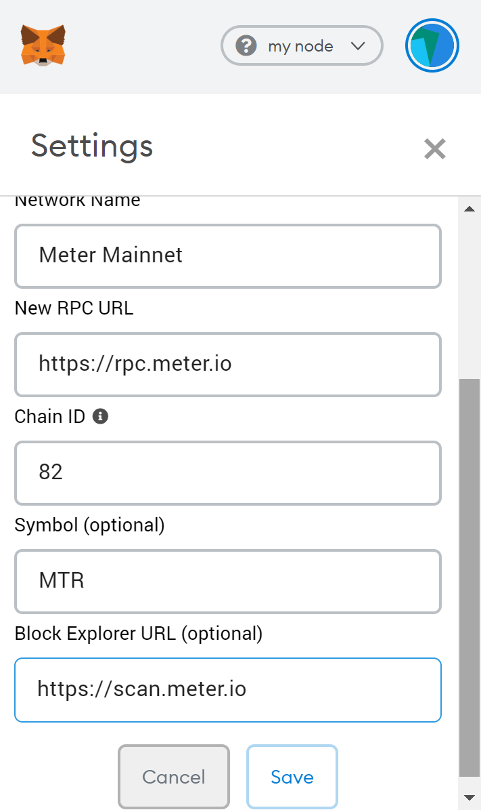

# Tutorials for Using Meter Passport

A video tutorial on using Meter Passport can be found here.

The bridge is currently secured by Protofire, Hashquark, InfinityStones, Wetez, and Meter.  3 out of these 5 relayers have to sign off on a transaction to go through.  Typical transfer between BSC, Moonriver, and Meter take around 10 to 20 seconds, while any transfer that involves Ethereum requires 25 block confirmations for the bridge deposit transaction on the Ethereum side \(When the UI shows "In transit"\) which may take 6 to 10 minutes.  

The bridge fee exists to support the gas spending and operations for the team of decentralized relayers.  Meter also has a bridge fee subsidy program that reimburses up to 85% of the bridge fee in MTRG.  Details could be found by clicking the “i” information icon beside the bridge fee.  For MoonRiver users, MTRG will be directly airdropped on the MoonRiver network at launch to cover bridge and gas fees on Ethereum.  This is a promotional program supported by the Meter Foundation to help the MoonRiver community building the initial DeFi ecosystem.  The MTRG tokens can be transferred to Meter Mainnet and traded on [VoltSwap](https://voltswap.finance).

Different assets are supported depend on the source and destination chains.  Click “Change” to select the network where you want to bring the tokens from. Then select the token and the amount. Make sure “I want to send funds to my address.” is checked for bridge fee subsidy and airdrops.  Lastly, click on “Start Transfer” to initiate the bridging.

2\) Allow Meter Passport to access the token that you want to bridge

3\) Now that your tokens have been bridged \(transferred\) to the destination.  If you are bridging into Meter should automatically receive 0.3 MTR airdrop in your wallet whenever you bridge an asset into Meter.  You could use it for the initial transfers and swaps on the Meter mainnet. 

