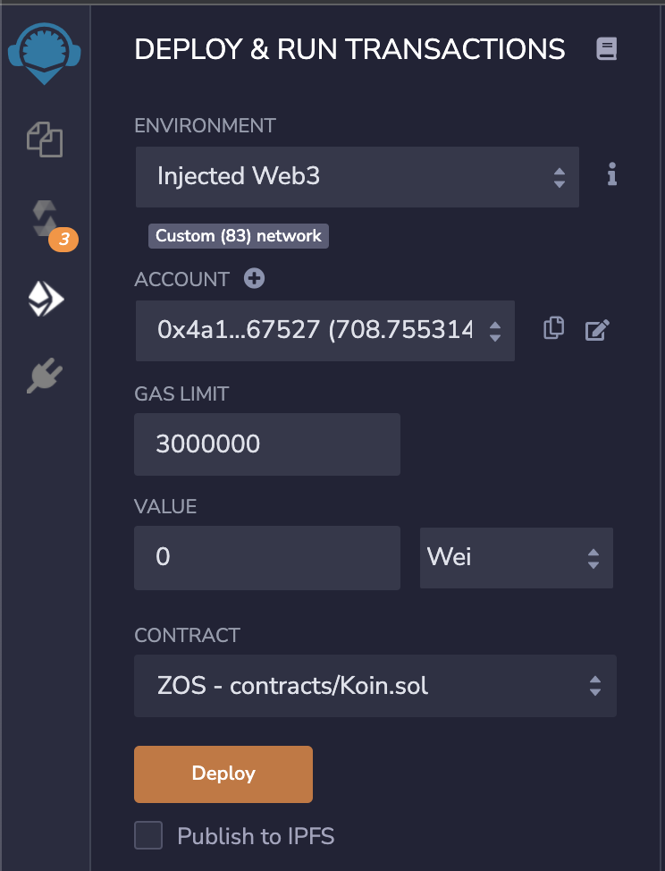
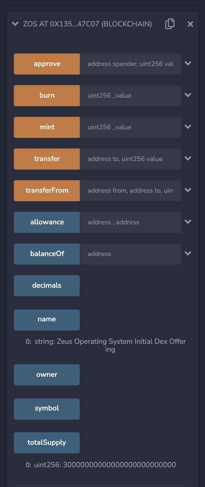

# How to migrate your Ethereum solidity contract to Meter

## Introduction

In this tutorial we will migrate an Ethereum ERC20 token to the Meter network.

## The contract source code

We randomly chose the following ERC20 contract: https://etherscan.io/address/0x15a78d9f5c1342279c18c0f057afdd8bf333d47f#code
Copy the contract source code & head to http://remix.ethereum.org/

## Create the .sol file

Paste the contract source code into a new .sol file.

## Compile the contract

Go to the "Solidity Compiler" tab and click on the "CreatedFileName.sol" button

## Deploy the contract

1) Click on the "Deploy & Run Transactions" tab
2) Select "Injected Web3" in the "Environment" section
3) Select ZOS in the "Contract" section
4) Make sure you're using the Meter testnet network ([Click here](https://github.com/meterio/meter_docs/blob/main/tutorials/tutorial1.md) for instructions on how to add Meter Testnet to Metamask)
5) Click deploy & sign the transaction in Metamask

You can now see the functions available of the deployed ERC20 contract.

## Conclusion

Migrating from Ethereum to Meter is very easy and only requires to follow a few steps.

[Click here](https://github.com/meterio/meter_docs/blob/main/tutorials/tutorial-remix.md) for a more detailed tutorial on deploying with Remix 
[Click here](https://github.com/meterio/meter_docs/blob/main/tutorials/tutorial-spending-tokens.md) to understand how to transfer MTRG & VOLT from your contract