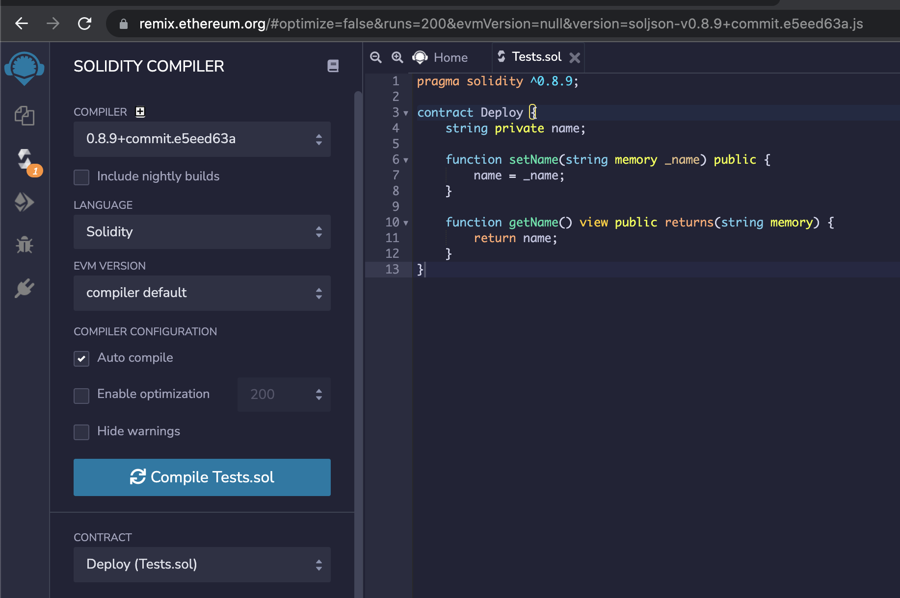
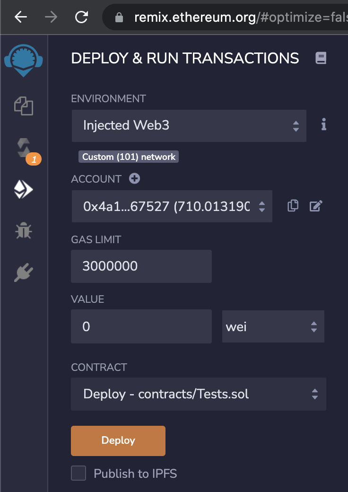
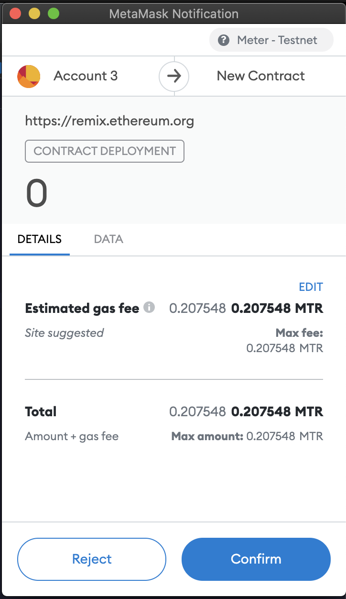
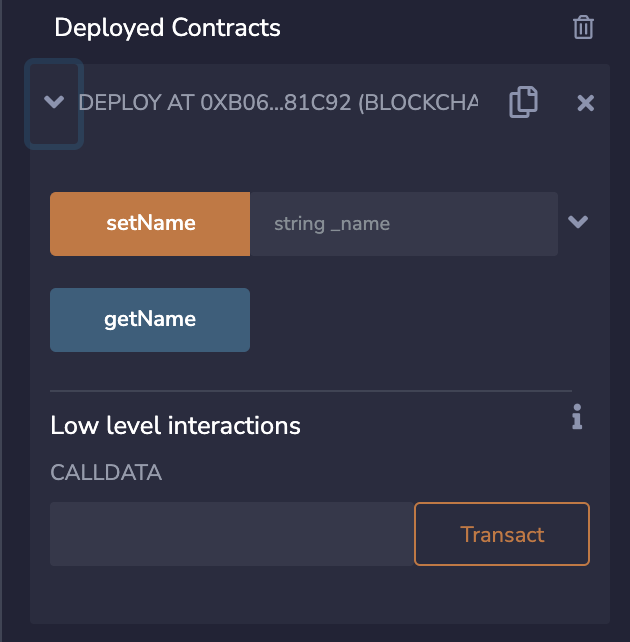

# Meter dAPP deployment with Remix

## Introduction

In this short tutorial you will learn how to deploy manually to the Meter network using Remix.
Remix is an Ethereum IDE, please follow this link to use it: [https://remix.ethereum.org/](https://remix.ethereum.org/)

## Create a simple contract

1. Go to the "File explorers" tab and create a new file (Tests.sol) under the contracts folder.
2. Copy & paste the following code

````solidity
pragma solidity ^0.8.9;

contract Deploy {
    string private name;
    
    function setName(string memory _name) public {
        name = _name;
    }
    
    function getName() view public returns(string memory) {
        return name;
    }
}
````

## Compile the contract

Go to the "Solidity Compiler" tab and click on the "Compile Tests.sol" button



## Deploy the contract

Go to the "Deploy & Run transactions tab". 
1. Under the "ENVIRONMENT" listbox select "Injected Web3". This option indicates Remix to use Metamask to connect to the desired network, in our case the Meter test net.
2. Under the "CONTRACT" listbox make sure "Deploy - contracts/Tests.sol" is selected
3. Click the "Deploy" button

4. Metamask will open and it will ask you to sign the transaction to complete the deployment

5. After a few seconds the transaction will be confirmed and the newly deployed contract will appear under "Deployed contracts"


## Conclusion

Deploying to the Meter network is very easy using the Remix IDE. To deploy to the Meter main net blockchain go to Metamask, switch to that network & repeat the five "Deploy the contract" steps.