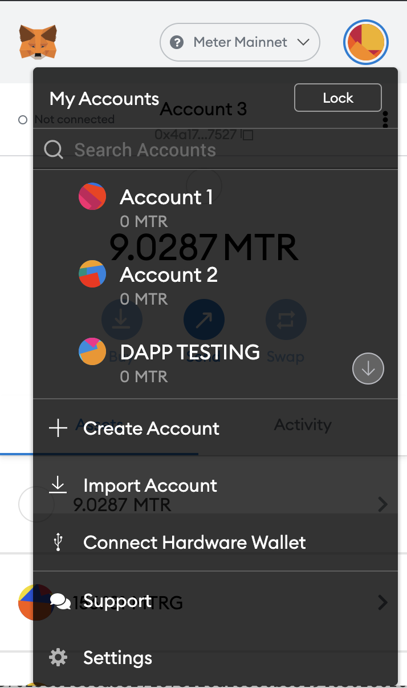
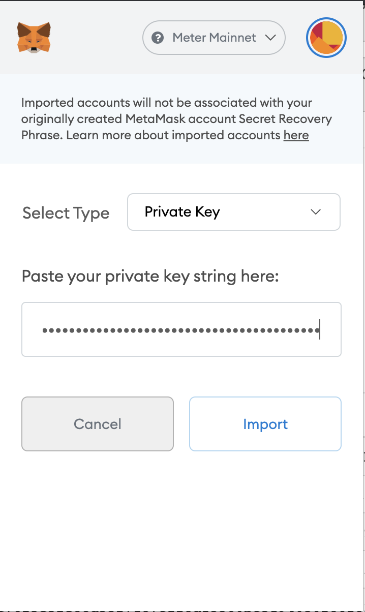
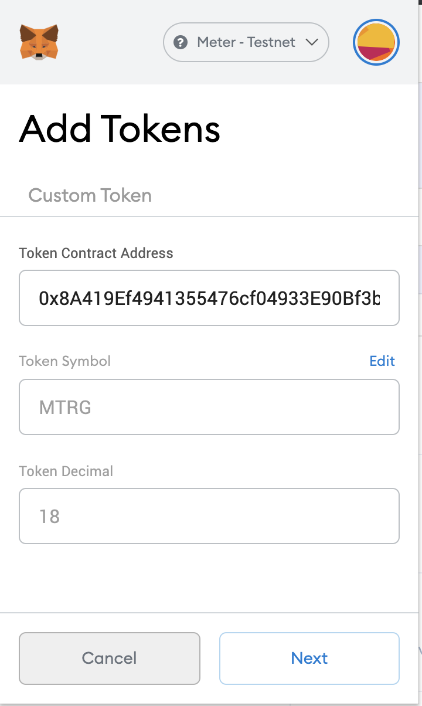
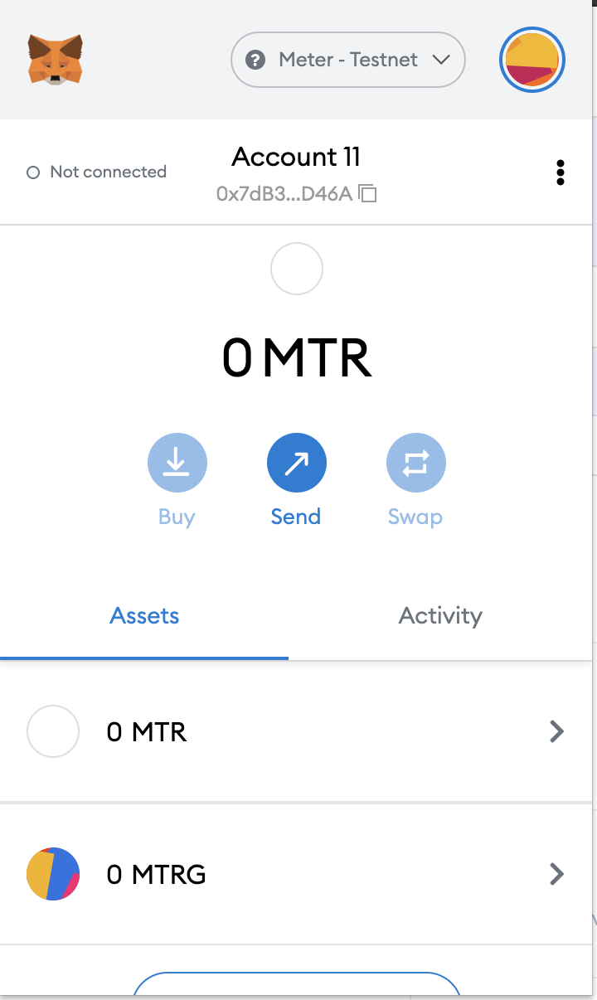

# Meter dAPP Development tutorial 1

## Introduction

This is the first tutorial of a development series aimed to provide developers with all the necessary information to start building dapps on the Meter network.
This first tutorial will show you how to deploy a simple smart contract to the Meter Testnet. You will also build a React application that connects to the contract and reads some data from the Meter testnet.
These tutorials are going to get straight to the point, so they will be short and concise.

## Metmask & receiving testnet tokens

### Generate Address

First of all you need to create some addresses using a Mnemonic generator
[https://iancoleman.io/bip39/](https://iancoleman.io/bip39/) Create addresses

1. Click on GENERATE button
2. Copy & Save the 15 words that have been generated
3. Select Coin -> ETH - Ethereum
4. Copy the first address' private key

### Metamask configuration

1. Open Mestamask and click on "Import Account"


2. Paste your private key


3. Add Meter Test network:
    Network name: Meter Testnet
    New RPC URL: https://rpctest.meter.io
    Chain ID: 101
    Currency Symbol: MTR
    Block explorer: https://scan-warringstakes.meter.io/


4. Add MTRG Testnet contract (click on "Add Token")
    Token Contract Address: 0x8A419Ef4941355476cf04933E90Bf3bbF2F73814
    Token Symbol: MTRG


5. MTR & MTRG should appear on the "Assets" tab


### Receive some MTR & MTRG tokens

1. Go to [http://faucet-warringstakes.meter.io/](http://faucet-warringstakes.meter.io/) 
2. Copy your recently imported address 
3. Paste it & click on the "Claim Now" button
4. You should receive some MTR & MTRG in a few seconds*

* If you don't receive MTRG go to https://t.me/Meter_IO# & ask for someone to send you some testnet MTRG 

## Download the contract boilerplate source code

Download/Clone the boilerplate meter contract, compile & deploy scripts.
[https://github.com/antonimassomola/meter-dev-series/tree/main/solidity-meter-boilerplate](https://github.com/antonimassomola/meter-dev-series/tree/main/solidity-meter-boilerplate) Meter boilerplate contract

### Install the dependencies

````bash
npm install
````

### Edit the deploy file

Edit the deploy.js file and replace the 15 mnemonic words with the ones you copied from the Mnemonic generator website (https://iancoleman.io/bip39/)

````javascript
const provider = new HDWalletProvider(
  'word1 word2 word3 word4 word5 word6 word7 word8 word9 word10 word11 word12 word13 word14 word15',
  'https://rpctest.meter.io'
);
````

### Deploying the contract

````bash
node deploy.js
````

Once the script is executed (compiled & deployed to the Meter Testnet network), in your console you will see something similar to this:

````bash
➜  solidity-meter-boilerplate node deploy.js
Attempting to deploy from account 0x0eb0C228B723dD32483b75D469661b0cDBE73264
[{"inputs":[],"stateMutability":"nonpayable","type":"constructor","signature":"constructor"},{"inputs":[],"name":"getArray","outputs":[{"internalType":"string[]","name":"","type":"string[]"}],"stateMutability":"view","type":"function","constant":true,"signature":"0xd504ea1d"},{"inputs":[{"internalType":"uint256","name":"","type":"uint256"}],"name":"myArray","outputs":[{"internalType":"string","name":"","type":"string"}],"stateMutability":"view","type":"function","constant":true,"signature":"0xcc3e57d9"},{"inputs":[],"name":"myString","outputs":[{"internalType":"string","name":"","type":"string"}],"stateMutability":"view","type":"function","constant":true,"signature":"0x492bfa18"}]
Contract deployed to 0x0Fdef7877e835d68ddC09Becce1bAa6e5a8c2919
````

## Download the react app boilerplate source code to interact with the contract

Download/Clone the boilerplate react web3 meter.
[https://github.com/antonimassomola/meter-dev-series/tree/main/react-web3-meter-boilerplate](https://github.com/antonimassomola/meter-dev-series/tree/main/react-web3-meter-boilerplate) Meter React & web3 boilerplate

### Install the dependencies

````bash
npm install
````

### Edit the demo.js file

Replace the consants address & abi with the contract address and JSON received when you previously executed the deploy.js script

````javascript
const address = '0x0Fdef7877e835d68ddC09Becce1bAa6e5a8c2919';
const abi = [{"inputs":[],"stateMutability":"nonpayable","type":"constructor","signature":"constructor"},{"inputs":[],"name":"getArray","outputs":[{"internalType":"string[]","name":"","type":"string[]"}],"stateMutability":"view","type":"function","constant":true,"signature":"0xd504ea1d"},{"inputs":[{"internalType":"uint256","name":"","type":"uint256"}],"name":"myArray","outputs":[{"internalType":"string","name":"","type":"string"}],"stateMutability":"view","type":"function","constant":true,"signature":"0xcc3e57d9"},{"inputs":[],"name":"myString","outputs":[{"internalType":"string","name":"","type":"string"}],"stateMutability":"view","type":"function","constant":true,"signature":"0x492bfa18"}];
````

### Testing the dApp

````bash
npm start
````

You can now view demo-react in the browser.

  Local:            http://localhost:3000
  On Your Network:  http://192.168.1.35:3000

Note that the development build is not optimized.
To create a production build, use npm run build.

Open your browser and browse to the URL shown above. Be sure that Metamask is connected to the Meter Testnet.
You should see the text "myString value is: Meter String Demo"
Meter String Demo has been retrieved from the contract that you have recently deployed.

## Conclusion

In this first tutorial you've learned how to compile and deploy a contract to the Meter Testnet. The contract is very simple and only has some variables that are publicly available to read. In the next tutorial you will learn how to transfer tokens and modify storage variables. You will also learn how to test your contract with Mocha and Ganache.